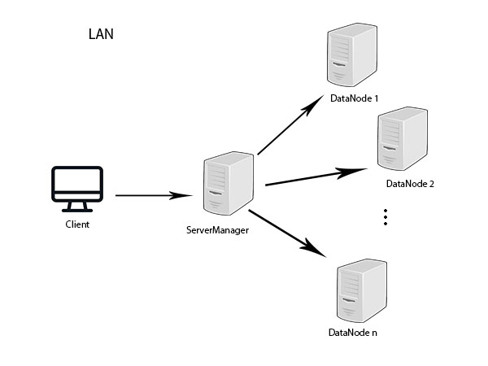

# Introduzione

MyDFS è un filesystem distribuito scritto in Java la cui architettura è ispirata a quella di Hadoop nella sua prima versione. Il sistema presenta quindi una grandissima scalabilità orrizzontale.

# Architettura

Il sistema presenta tre tipologie di macchine:

	1) Data node (ServerClass): nodo che si occupa della gestione di file. È coordinato dal ServerManager
	2) ServerManger: è il nodo che coordina i vari Data nodes e che comunica direttamente con il client
	3) Client (ClientClass): è il processo client del sistema

Client e Server in realtà sono tutte maccchine connesse alla stessa rete locale e non fisicamente collegate tra di loro come nello schema soprastante.
Viene tuttavia creata una rete virtuale com'è rappresentata nell'immagine.

NB: il sistema è in grado di gestire più client contemporaneamente

Maggiori informazioni nella [documentazione](./Documentation/index.html)

# Istruzioni per l'uso

## Dipendenze

- java11

NB: il software è stato testato e sviluppato su Linux, l'esecuzione corretta su altri sistemi operativi non è garantita!

## Installazione:

1) nella cartella "installation" aprire un terminale
2) eseguire "./serverSetup.sh [installation_directory]"

NB: se la cartella di installazione non viene specificata, il software viene installato di default nella directory
/home/myDfsUser. I file del file-system distribuito vengono allocati all'interno della directory di installazione. Se per 
esempio questa viene configurata in un disco secondario, lo spazio offerto dal nodo sarà pari allo spazio allocabile nel disco secondario.
 

Questa procedura va ripetuta per ogni macchina che si vuole inserire nel file-system distribuito

Assicurarsi di avere i permessi corretti di accesso per il nuovo utente alla directory di installazione. 
Nel caso di dischi secondari può essere necessario configurare correttamente le access control list.

    -   sudo setfacl -m:myDfsUser:rwx /media/myuser/disk_label

## Procedura di reinstallazione

1) nella cartella "installation" aprire un terminale ed eseguire "sudo ./reinstall.sh"

## RUN

### Data Nodes

In tutti i nodi dedicati allo storage dei dati (Data nodes):

	1) apri un terminale nella directory "run/slave/"
	2) eseguire ./slaveInit.sh 
	3) apri un altro terminale nella directory "run/slave"
	4) eseguire ./slaveRun.sh

Per il nodo dedicato alla gestione dei vari Data nodes è necessario eseguire i seguenti comandi (è possibile anche definire come ServerManager un Data Node):

### ServerManager:

NB: se il nodo è già avviato come "Data node" saltare i passi 1 e 2

	1) apri un terminale nella directory "run/serverManager"
	2) eseguire ./serverManager_init.sh
	3) apri un altro terminale nella directory "run/serverManager"
	4) eseguire ./serverManager_run.sh <slave_ip>...

slave_ip deve essere nel formato:  //ip_slave/server_name

NB: i nomi dei server devono essere differenti l'uno dall'altro, un uso scorretto potrebbe compromettere il funzionamento del software

### Client

Ora un qualsiasi host connesso alla stessa rete locale può diventare un potenziale client per il cluster:

	1) eseguire ./client_run.sh <ip_serverManager> 
	

## Comandi

Digitare il comando "help" per ottenere la lista di comandi che il software mette a disposizione.

- ls: restituisce i file nella directory corrente
- cd: cambia la directory corrente
- rm: rimuove file dal filesystem distribuito
- cp: copia file locali nel filesystem distribuito e viceversa
- mkdir: crea una directory nel file system distribuito
- mv: muove file/directory all'interno del file system distribuito
- du: mostra la disponibilità del cluster
- sview: mostra i nodi a cui il serverManager è connesso
- open: apri un file del filesystem distribuito
- exit: serve per smontare il cluster dal sistema
  

Digitando "help <nome_comando> si ottiene il manuale relativo a quel comando"