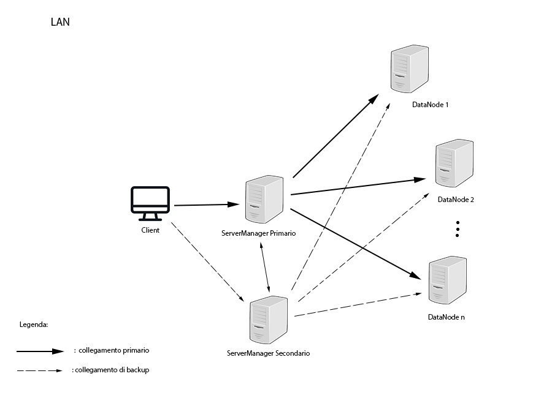

# Introduzione

MyDFS è un filesystem distribuito scritto in Java la cui architettura è ispirata a quella di Hadoop nella sua prima versione. Il sistema presenta quindi una grandissima scalabilità orrizzontale.

# Architettura

Il sistema presenta tre tipologie di macchine:

	1) Data node (ServerClass): nodo che si occupa della gestione di file. È coordinato dal ServerManager
	2) ServerManger: è il nodo che coordina i vari Data nodes e che comunica direttamente con il client
	3) Client (ClientClass): è il processo client del sistema

Client e Server in realtà sono tutte maccchine connesse alla stessa rete locale e non fisicamente collegate tra di loro come nello schema soprastante.
Viene tuttavia creata una rete virtuale com'è rappresentata nell'immagine.

NB: il sistema è in grado di gestire più client contemporaneamente

  L'architettura del sistema è ispirata a quella di Hadoop nella sua prima versione, la più semplice.
 L'architettura è divisa in due livelli:
 <ul>
      <li>
         Client - ServerManager
      </li>
     <li>
         ServerManager - ServerClass
      </li>
  </ul>
  Il ServerManager prende anche il nome di "Node Master", il suo compito è quello di interagire direttamente con il client
  e gestire la distribuzione del carico di lavoro che viene affidato ai vari Data Node (ServerClass). Svolge quindi un lavoro
 da controllore. L'intera architettura è basata sulla tipologia Master - Slave. Il Node Manger svolge quindi la funzione di
 Master e i vari Data Nodes svolgono la funzione di Slaves.
  

  Gli slave nodes (ServerClass) si occupano invece di tenere memorizzati i dati. Gli slave nodes condividono tutti la stessa
  struttura di directory, in questo modo è possibile bilanciare equamente lo spazio allocato su ogni slave.
  

 

  Il serverManager è in grado di gestire un numero corposo di client allo stesso tempo e un numero di slave illimitato. Più slave
 saranno presenti nel cluster, più sarà lo spazio a disposizione disponibile. La scalabilità orrizzontale del sistema è quindi una proprietà
  di questa particolare tipologia di architettura.
  

### ServerManager secondario

Il sistema nel suo funzionamento più semplice è resistente a fallimenti solo nei Data Nodes, il serverManager 
è un single point of failure (SPOF). Per questo è stato introdotto un meccanismo per rendere più resistente questo punto
debole. In particolare è possibile designare anche un server manager secondario che viene attivato solo se il serverManager 
primario crasha e assume temporaneamente il ruolo di ServerManager primario, fino a quando quello originale non ripristina il 
suo funzionamento.

Maggiori informazioni nella [documentazione](./Documentation/index.html) del codice

### Consistenza e affidabilità

È stato introdotto un meccanismo complesso di controllo per mantenere i filesystem consistenti
tra di loro ed avere un certo livello di affidabilità nel sistema. Vedi [consistenza_e_affidabilità.pdf]

# Istruzioni per l'uso

## Dipendenze

- java11

NB: il software è stato testato e sviluppato su Linux, l'esecuzione corretta su altri sistemi operativi non è garantita!

## Installazione:

1) nella cartella "installation" aprire un terminale
2) eseguire "./serverSetup.sh [installation_directory]"

NB: se la cartella di installazione non viene specificata, il software viene installato di default nella directory
/home/myDfsUser. I file del file-system distribuito vengono allocati all'interno della directory di installazione. Se per 
esempio questa viene configurata in un disco secondario, lo spazio offerto dal nodo sarà pari allo spazio allocabile nel disco secondario.
 

Questa procedura va ripetuta per ogni macchina che si vuole inserire nel file-system distribuito

Assicurarsi di avere i permessi corretti di accesso per il nuovo utente alla directory di installazione. 
Nel caso di dischi secondari può essere necessario configurare correttamente le access control list.

    -   sudo setfacl -m:myDfsUser:rwx /media/myuser/disk_label

## Procedura di reinstallazione

1) nella cartella "installation" aprire un terminale ed eseguire "sudo ./reinstall.sh"

## RUN

### Data Nodes

In tutti i nodi dedicati allo storage dei dati (Data nodes):

	1) apri un terminale nella directory "run/slave/"
	2) eseguire ./slaveInit.sh 
	3) apri un altro terminale nella directory "run/slave"
	4) eseguire ./slaveRun.sh

Per il nodo dedicato alla gestione dei vari Data nodes è necessario eseguire i seguenti comandi (è possibile anche definire come ServerManager un Data Node):

### ServerManager:

NB: se il nodo è già avviato come "Data node" saltare i passi 1 e 2

	1) apri un terminale nella directory "run/serverManager"
	2) eseguire ./serverManager_init.sh
	3) apri un altro terminale nella directory "run/serverManager"
	4) eseguire ./serverManager_run.sh <slave_ip>... [-s/-p ip_serverManager secondario/primario]

slave_ip deve essere nel formato:  //ip_slave/server_name

NB: i nomi dei server devono essere differenti l'uno dall'altro, un uso scorretto potrebbe compromettere il funzionamento del software

#### ServerManager secondario

Configurazione dei serverManager nel caso si voglia usare anche il serverManager secondario di backup

##### ServerManager primario

    1) apri un altro terminale nella directory "run/serverManager"
    2) eseguire ./serverManager_run.sh <slave_ip>... [-s ip_serverManager secondario]
    
##### ServerManager secondario

    1) apri un altro terminale nella directory "run/serverManager"
    2) eseguire ./serverManager_run.sh <slave_ip>... [-p ip_serverManager primario]

### Client

Ora un qualsiasi host connesso alla stessa rete locale può diventare un potenziale client per il cluster:

	1) eseguire ./client_run.sh <ip_serverManager>...
	
NB: se voglio attivare la modalità di funzionamento a due serverManager devo inserire gli ip di entrambi nel 
comando
## Comandi

Digitare il comando "help" per ottenere la lista di comandi che il software mette a disposizione.

- ls: restituisce i file nella directory corrente
- cd: cambia la directory corrente
- rm: rimuove file dal filesystem distribuito
- cp: copia file locali nel filesystem distribuito e viceversa
- mkdir: crea una directory nel file system distribuito
- mv: muove file/directory all'interno del file system distribuito
- du: mostra la disponibilità del cluster
- sview: mostra i nodi a cui il serverManager è connesso
- open: apri un file del filesystem distribuito
- exit: serve per smontare il cluster dal sistema
  

Digitando "help <nome_comando> si ottiene il manuale relativo a quel comando"

# Sviluppo

La modalità di sviluppo è accessibile seguendo le istruzioni presenti nel file [runninginstruction](./src/runningInstruction.txt).
Utilizzando la modalità di sviluppo è possibile sviluppare e debuggare il software in maniera più fluida ed efficiente (non vengono utilizzati 
gli script .sh).